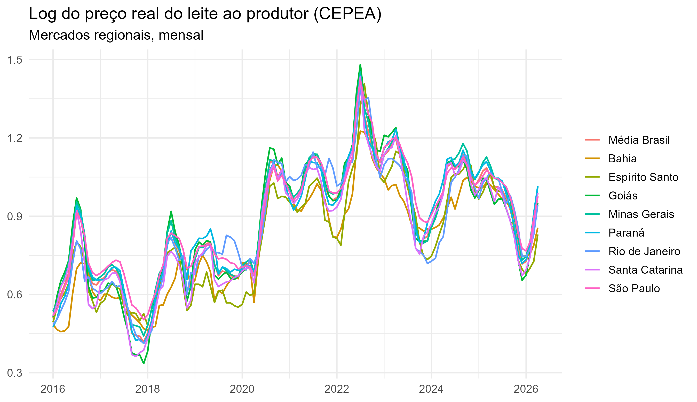
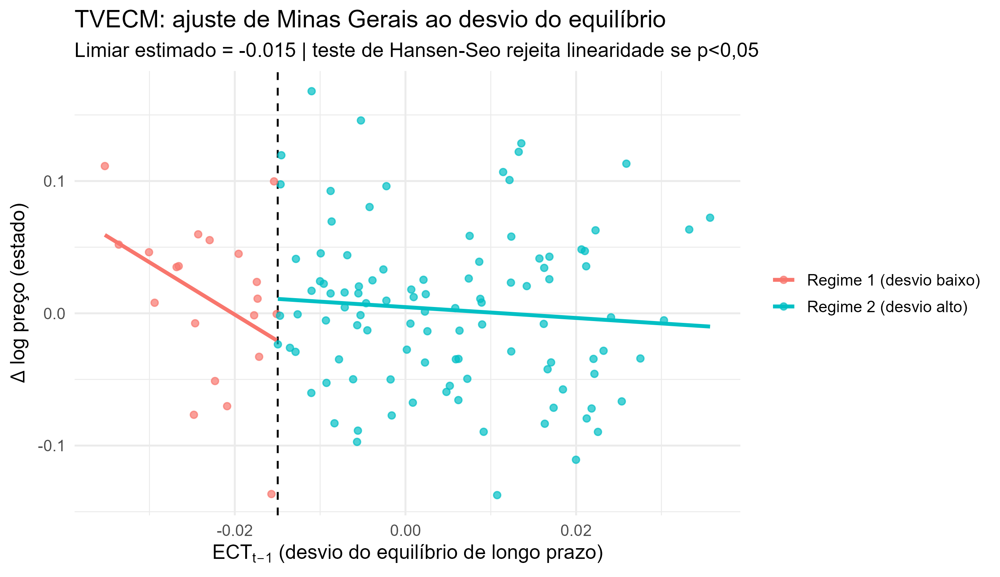

# Transmissão de Preços do Leite ao Produtor entre Regiões Brasileiras

Análise econométrica da **integração e transmissão espacial** de preços do leite ao
produtor entre as principais regiões do Brasil, com dados mensais do **CEPEA/ESALQ-USP**
(jan/2016–abr/2026) deflacionados pelo **IPCA**. O estudo aplica o arcabouço clássico de
transmissão de preços agrícolas — cointegração, correção de erro, assimetria e modelos
com limiar (TVECM) — e entrega o artigo pronto no **formato ANPEC**.

  

## Principais achados

- **Mercados fortemente integrados**: séries $I(1)$ e cointegradas (Johansen +
  Phillips-Ouliaris); elasticidades de longo prazo próximas de 1 (**Lei do Preço Único**).
- **Ajuste rápido ao equilíbrio**: correção de erro de **15% a 46% ao mês** (Santa
  Catarina e Paraná os mais integrados).
- **Transmissão majoritariamente simétrica** entre altas e baixas (ECM assimétrico e M-TAR).
- **Banda de não-arbitragem**: o teste de Hansen-Seo detecta **efeito de limiar** (TVECM)
  em pares selecionados (ex.: Minas Gerais e São Paulo), compatível com custos de transação.
- **Liderança de preço** da referência nacional e dos grandes estados produtores (Granger,
  IRF/FEVD).

<p align="center">
  
  
</p>

## Estrutura do repositório

```
.
├── R/                              # scripts (rodar a partir da raiz do repositório)
│   ├── construir_base_cepea.R      #  1. lê os .xls do CEPEA -> dados/cepea_leite_regioes.csv
│   ├── analise_transmissao_leite.R #  2. análise de transmissão (figuras + tabelas + relatório)
│   ├── gerar_latex.R               #  3. gera as tabelas .tex (kableExtra) e o projeto Overleaf
│   └── analise_preco_leite.R       #  (complementar) previsão univariada via API do IPEA
├── dados/
│   ├── brutos_cepea/               # 12 planilhas .xls originais do CEPEA (fonte)
│   └── cepea_leite_regioes.csv     # base tratada (long): região × mês × preços
├── resultados_transmissao/
│   ├── fig/                        # 7 figuras (PNG 300 dpi)
│   ├── tab_*.csv                   # tabelas de resultados
│   └── relatorio_transmissao.txt   # relatório em texto
├── overleaf/                       # projeto LaTeX (formato ANPEC) pronto p/ upload
│   ├── main.tex, referencias.bib, README.txt
│   ├── tabelas/ (booktabs, kableExtra)  e  figuras/
│   └── preview_main.pdf            # PDF compilado (preview)
├── entregaveis/
│   └── Relatorio_Transmissao_Precos_Leite.docx   # relatório em Word
├── LICENSE  ·  .gitignore  ·  README.md
```

## Como reproduzir

**Requisitos:** R ≥ 4.2 · [LibreOffice](https://www.libreoffice.org/) (converter os `.xls`
do CEPEA) · uma distribuição LaTeX (para compilar o Overleaf localmente, opcional).

Pacotes R: `tidyverse, lubridate, zoo, urca, vars, tseries, forecast, lmtest, sandwich,
tsDyn, reshape2, plotly, htmlwidgets, httr, jsonlite, kableExtra, readxl` (os scripts
instalam o que faltar).

Rode **a partir da raiz do repositório**:

```r
source("R/construir_base_cepea.R")      # (opcional) regenera o CSV a partir dos .xls
source("R/analise_transmissao_leite.R") # gera figuras, tabelas e relatório
source("R/gerar_latex.R")               # gera as tabelas .tex e atualiza overleaf/
```

Para o artigo: suba a pasta `overleaf/` no [Overleaf](https://www.overleaf.com)
(*New Project → Upload Project*), compilador **pdfLaTeX**.

## Dados

- **Preço do leite**: Indicador CEPEA/ESALQ-USP — preço líquido médio recebido pelo
  produtor (R$/litro), mensal, por região. Fonte: <https://www.cepea.esalq.usp.br/br/indicador/leite.aspx>
- **Deflator (IPCA)**: número-índice do IBGE, obtido via **API OData do IPEA**
  (série `PRECOS12_IPCA12`).
- Mantêm-se as 9 regiões com cobertura completa (Média Brasil + BA, ES, GO, MG, PR, RJ,
  SC, SP); Ceará e Mato Grosso do Sul foram excluídos por séries interrompidas.

## Metodologia

Raiz unitária (ADF, PP, KPSS) · cointegração de **Johansen** e **Phillips-Ouliaris** ·
**ECM** e **ECM assimétrico** (von Cramon-Taubadel & Loy) · cointegração com limiar
**M-TAR** (Enders & Siklos) · **TVECM** com teste de **Hansen & Seo** (banda de
não-arbitragem; Balke & Fomby) · **causalidade de Granger** · **VAR/IRF/FEVD**.

## Licença e citação

Código sob licença **MIT** (ver [LICENSE](LICENSE)). Os dados pertencem ao CEPEA/ESALQ-USP
e ao IBGE/IPEA (redistribuídos apenas para reprodutibilidade acadêmica).

> Bezerra, V. (2026). *Transmissão de preços do leite ao produtor entre regiões
> brasileiras: cointegração, correção de erro, assimetria e modelos com limiar (TVECM)*.

**Autor:** Valber Bezerra — valber.gregory@gmail.com
